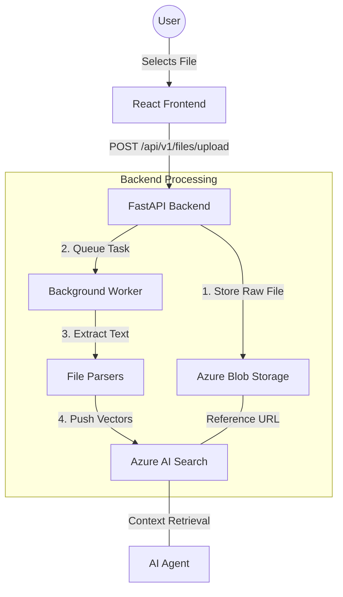

# File Upload and Storage System Documentation

This document provides a comprehensive technical overview of how files are uploaded, stored, and indexed in the AI Assistant project.

## 1. System Architecture Overview

The system follows a distributed architecture where the frontend handles user interaction, the backend manages business logic and orchestration, and Azure cloud services provide persistent storage and AI capabilities.



---

## 2. Frontend Implementation

### Service Layer: `fileService.ts`
The frontend uses a dedicated service to handle API communication. 

- **File**: `Ai_Assistant_Frontend/src/services/fileService.ts`
- **Method**: `uploadFile(file: File)`
- **Mechanism**: 
    1. Creates a `FormData` object.
    2. Appends the binary file under the key `'file'`.
    3. Sends an HTTP POST request with `Content-Type: multipart/form-data`.

---

## 3. Backend Processing

### API Endpoint: `files.py`
The entry point for file uploads is located in `backend/app/api/v1/endpoints/files.py`.

#### Key Responsibilities:
1. **Validation**: Check file existence and type.
2. **Persistence**: Upload the raw file to Azure Blob Storage immediately.
3. **Asynchronicity**: Trigger a background task for indexing to ensure the UI remains responsive.

```python
@router.post("/upload")
async def upload_file(background_tasks: BackgroundTasks, file: UploadFile = File(...)):
    file_id = str(uuid.uuid4()) # Unique ID for isolation
    content = await file.read()
    
    # Storage
    blob_url = await _upload_to_blob(file.filename, content, file_id)
    
    # Background Indexing
    background_tasks.add_task(_process_and_index_file, file_id, content, ...)
```

---

## 4. Storage and Indexing

### Azure Blob Storage
- **Container**: Configured via `AZURE_STORAGE_CONTAINER`.
- **Path Structure**: `{file_id}/{filename}`.
- **Purpose**: Acts as the "Source of Truth" for the original documents.

### Text Extraction
The system supports multiple formats by using specific libraries:
- **PDF**: `pypdf`
- **Excel**: `pandas`
- **Word**: `python-docx`
- **Text/Markdown/CSV**: Standard UTF-8 decoding.

### Azure AI Search (RAG Indexing)
Once text is extracted, it is passed to `RAGIndexer`:
1. **Chunking**: Large documents are split into smaller segments.
2. **Embedding**: Each segment is converted into a vector representation.
3. **Storage**: Vectors and metadata (like the `blob_url`) are stored in the AI Search index.

---

## 5. Metadata and Security

- **File Metadata**: The system stores the `file_id`, `filename`, `file_type`, `size`, and `status`.
- **Reference integrity**: The `blob_url` stored in the vector index allows the AI Assistant to provide direct links to the original files in its chat responses.
- **Status Tracking**:
    - `pending`: Uploaded to Blob Storage.
    - `processing`: Text is being extracted.
    - `indexed`: Available for AI Assistant queries.
    - `failed`: An error occurred during extraction or indexing.
