# Agent Architecture Documentation - Easy Guide

> **What is this?** This guide explains how our AI agents work in simple terms with lots of pictures and diagrams.

---

## 📖 Table of Contents
1. [The Big Picture](#the-big-picture)
2. [How Does a Request Flow?](#how-does-a-request-flow)
3. [The Three Main Parts](#the-three-main-parts)
4. [Step-by-Step: What Happens When You Ask a Question?](#step-by-step-what-happens-when-you-ask-a-question)
5. [How to Create Your Own Agent](#how-to-create-your-own-agent)

---

## � The Big Picture

**Think of it like a restaurant:**
- **You** (the customer) = User asking questions
- **Waiter** = Agent Orchestrator (decides which chef to send your order to)
- **Chefs** = Different Agents (Analyst, Researcher, Python Coder, etc.)
- **Recipe Book** = Azure AI (the smart brain that knows everything)
- **Pantry** = Data Storage (where files and information are kept)

```mermaid
graph LR
    User([👤 You]) -->|Ask Question| Waiter[🍽️ Orchestrator]
    Waiter -->|Routes to| Chef1[👨‍🍳 Analyst Agent]
    Waiter -->|Routes to| Chef2[👨‍🍳 Researcher Agent]
    Waiter -->|Routes to| Chef3[👨‍🍳 Python Agent]
    
    Chef1 -->|Uses| RecipeBook[📚 Azure AI]
    Chef2 -->|Uses| RecipeBook
    Chef3 -->|Uses| RecipeBook
    
    Chef1 -->|Checks| Pantry[🗄️ Data Storage]
    Chef2 -->|Checks| Pantry
    Chef3 -->|Checks| Pantry
    
    Chef1 -->|Returns Answer| User
    Chef2 -->|Returns Answer| User
    Chef3 -->|Returns Answer| User
```

---

## 🔄 How Does a Request Flow?

When you ask a question, here's the journey it takes:

```mermaid
sequenceDiagram
    participant User as 👤 You
    participant Orch as 🍽️ Orchestrator
    participant Agent as 👨‍🍳 Agent
    participant Data as 🗄️ Data Layer
    participant AI as 📚 Azure AI
    
    User->>Orch: "Analyze my sales data"
    Orch->>Agent: Route to Analyst Agent
    
    Note over Agent: Step 1: Get Context
    Agent->>Data: Search for "sales data"
    Data-->>Agent: Returns metadata only<br/>(filename, columns, etc.)
    
    Note over Agent: Step 2: Build Prompt
    Agent->>Agent: Combine question + metadata
    
    Note over Agent: Step 3: Ask AI
    Agent->>AI: Send prompt to Azure OpenAI
    AI-->>Agent: Returns intelligent response
    
    Agent->>User: Final Answer with insights
```

---

## 🧩 The Three Main Parts

### Part 1: BaseAgent (The Template)

**What is it?** Think of `BaseAgent` as a cookie cutter. Every agent is made from this same shape.

**What does it do?**
1. 🔍 **Retrieves Context** - Looks up relevant information
2. 🤖 **Talks to AI** - Sends questions to Azure AI
3. 📤 **Returns Answer** - Gives you the response

```mermaid
graph TD
    Start([Agent Receives Question]) --> Retrieve[🔍 Step 1: Retrieve Context<br/>from Data Storage]
    Retrieve --> Build[📝 Step 2: Build Prompt<br/>Question + Context + Instructions]
    Build --> LLM[🤖 Step 3: Send to Azure AI<br/>via SDK]
    LLM --> Format[📦 Step 4: Format Response]
    Format --> End([Return Answer to User])
    
    style Start fill:#e1f5ff
    style End fill:#d4edda
    style LLM fill:#fff3cd
```

### Part 2: Azure AI Foundry SDK (The Connection)

**What is it?** This is the "phone line" that connects our agents to Azure's AI brain.

**How does it work?**

```mermaid
graph LR
    subgraph "Your Computer"
        Agent[👨‍🍳 Agent<br/>wants to ask AI]
        SDK[📞 SDK Client<br/>AzureAIFoundryClient]
    end
    
    subgraph "Microsoft Azure Cloud"
        AI[🧠 GPT-4<br/>AI Model]
    end
    
    Agent -->|1. Calls| SDK
    SDK -->|2. Connects<br/>using API Key| AI
    AI -->|3. Returns<br/>Smart Answer| SDK
    SDK -->|4. Gives back| Agent
    
    style SDK fill:#fff3cd
    style AI fill:#d4edda
```

**The Code Behind It (Simplified):**

```python
# 1. CREATE THE CONNECTION
client = AsyncAzureOpenAI(
    azure_endpoint="https://your-ai.openai.azure.com",
    api_key="your-secret-key"
)

# 2. SEND A QUESTION
response = await client.chat.completions.create(
    model="gpt-4",
    messages=[
        {"role": "system", "content": "You are a helpful analyst"},
        {"role": "user", "content": "What is in my sales data?"}
    ]
)

# 3. GET THE ANSWER
answer = response.choices[0].message.content
```

### Part 3: Data Access Layer (The Security Guard)

**What is it?** This is like a security guard who makes sure agents can't see private data.

**Important Rule:** Agents can ONLY see:
- ✅ File names (e.g., "sales_2024.csv")
- ✅ Column names (e.g., "customer_id, revenue, date")
- ✅ Data types (e.g., "number, text, date")

**They CANNOT see:**
- ❌ Actual customer names
- ❌ Actual revenue numbers
- ❌ Any real data values

```mermaid
graph TD
    Agent[👨‍🍳 Agent asks:<br/>"Show me sales data"] -->|Request| Guard[🛡️ Data Access Layer<br/>Security Guard]
    
    Guard -->|Searches| RAG[📁 Azure AI Search<br/>Document Metadata]
    Guard -->|Searches| KAG[🔗 Cosmos DB<br/>Knowledge Graph]
    
    RAG -->|Returns| Meta1[✅ Metadata Only<br/>Filename: sales.csv<br/>Columns: id, revenue, date]
    KAG -->|Returns| Meta2[✅ Metadata Only<br/>Entity: Customer<br/>Properties: name, email]
    
    Meta1 --> Guard
    Meta2 --> Guard
    Guard -->|Filtered Data| Agent
    
    style Guard fill:#f8d7da
    style Meta1 fill:#d4edda
    style Meta2 fill:#d4edda
```

---

## 🎬 Step-by-Step: What Happens When You Ask a Question?

Let's say you type: **"Analyze my sales data"**

### 🎯 Step 1: Orchestrator Picks the Right Agent
```mermaid
graph LR
    Q["❓ Question:<br/>Analyze my sales data"] --> O[🍽️ Orchestrator]
    O -->|"This needs<br/>analysis!"| A[👨‍🍳 Analyst Agent<br/>✓ Selected]
    O -.->|Not needed| R[👨‍🍳 Researcher<br/>✗ Not selected]
    O -.->|Not needed| P[👨‍🍳 Python Coder<br/>✗ Not selected]
    
    style A fill:#d4edda
    style R fill:#f0f0f0
    style P fill:#f0f0f0
```

### 🔍 Step 2: Agent Looks for Context
```mermaid
graph TD
    Agent[👨‍🍳 Analyst Agent] -->|"Find 'sales data'"| DAL[🛡️ Data Access Layer]
    DAL -->|Searches| DB[(🗄️ Storage)]
    DB --> Result["📋 Found:<br/>• sales_2024.csv<br/>• Columns: date, product, revenue<br/>• 1000 rows"]
    Result --> Agent
    
    style Result fill:#d4edda
```

### 🤖 Step 3: Agent Builds a Prompt and Asks Azure AI
```mermaid
graph LR
    Agent[👨‍🍳 Agent] --> Combine["📝 Combines:<br/>1. Your question<br/>2. File metadata<br/>3. Agent instructions"]
    Combine --> Prompt["💬 Final Prompt:<br/>'You are an analyst.<br/>User has sales_2024.csv<br/>with date, product, revenue.<br/>Analyze this dataset.'"]
    Prompt -->|Sends via SDK| AI[🧠 Azure OpenAI<br/>GPT-4]
    AI --> Answer["✨ AI Response:<br/>'Your sales data contains...'"]
    
    style AI fill:#fff3cd
    style Answer fill:#d4edda
```

### 📤 Step 4: Agent Returns the Answer to You
```mermaid
graph LR
    AI[🧠 AI Response] --> Agent[👨‍🍳 Agent]
    Agent --> Format["📦 Formats as:<br/>AgentResponse object"]
    Format --> User["👤 You see the answer!<br/>'Your sales data shows...'"]
    
    style User fill:#d4edda
```

---

## 🛠️ How to Create Your Own Agent

Want to make a new agent? Follow this simple recipe:

```mermaid
graph TD
    Start([🎯 Start]) --> Step1["1️⃣ Create folder<br/>agents/my_agent/"]
    Step1 --> Step2["2️⃣ Create agent.py file"]
    Step2 --> Step3["3️⃣ Write class:<br/>class MyAgent(BaseAgent)"]
    Step3 --> Step4["4️⃣ Define system_prompt<br/>(personality & instructions)"]
    Step4 --> Step5["5️⃣ Register in registry.py"]
    Step5 --> Done([✅ Done!])
    
    style Start fill:#e1f5ff
    style Done fill:#d4edda
```

### Minimal Code Example:

```python
# File: agents/my_agent/agent.py
from agents.base.agent import BaseAgent

class MyAgent(BaseAgent):
    def __init__(self):
        super().__init__(
            name="My Custom Agent",
            description="Does something cool!"
        )
    
    def _get_system_prompt(self):
        return """You are a helpful assistant.
        Your job is to help users with X, Y, Z."""
    
    def _get_tools(self):
        return []  # No special tools needed
```

That's it! Your agent can now:
✅ Access data metadata (via `self.data_layer`)  
✅ Talk to Azure AI (via `self.llm`)  
✅ Return smart answers (via `execute()`)

---

## 🎓 Summary in One Picture

```mermaid
graph TB
    subgraph "1. YOUR QUESTION"
        User([👤 You ask a question])
    end
    
    subgraph "2. ROUTING"
        Orch[🍽️ Orchestrator picks<br/>the right agent]
    end
    
    subgraph "3. AGENT PROCESSING"
        Agent[👨‍🍳 Agent]
        Agent --> GetData[🔍 Get metadata<br/>from storage]
        Agent --> BuildPrompt[📝 Build prompt<br/>with context]
        Agent --> CallAI[🤖 Call Azure AI<br/>via SDK]
    end
    
    subgraph "4. AI MAGIC"
        AI[🧠 Azure OpenAI<br/>processes request]
    end
    
    subgraph "5. YOUR ANSWER"
        Response([📤 You get a<br/>smart response!])
    end
    
    User --> Orch
    Orch --> Agent
    CallAI --> AI
    AI --> Response
    
    style User fill:#e1f5ff
    style AI fill:#fff3cd
    style Response fill:#d4edda
```

---

## � Security Reminder

> [!IMPORTANT]
> **Agents are BLIND to actual data!**  
> They only see:
> - 📝 Metadata (file names, column names)
> - 🔗 Structure (entity relationships)
> 
> They NEVER see:
> - ❌ Your actual customer names
> - ❌ Your actual revenue numbers
> - ❌ Any sensitive values

This keeps your data **safe and private**! 🔒

---

## � The Actual Code - Where is the SDK?

Let me show you the **REAL CODE** and point out exactly where the SDK is used!

### 🔍 File 1: `backend/app/core/azure_client.py` - The SDK Wrapper

This file contains the **Azure OpenAI SDK** and wraps it for our use.

```python
# File: backend/app/core/azure_client.py
from typing import Optional, List
# ⬇️⬇️⬇️ THIS IS THE SDK! ⬇️⬇️⬇️
from openai import AsyncAzureOpenAI  # 📦 The Azure OpenAI SDK
# ⬆️⬆️⬆️ THIS IS THE SDK! ⬆️⬆️⬆️

from app.core.config import settings


class AzureAIFoundryClient:
    """This class WRAPS the SDK to make it easier to use"""
    
    def __init__(self):
        # Get configuration from environment variables
        self.endpoint = settings.AZURE_OPENAI_ENDPOINT  # e.g., "https://your-ai.openai.azure.com"
        self.api_key = settings.AZURE_OPENAI_API_KEY    # Your secret key
        self.deployment = settings.AZURE_OPENAI_DEPLOYMENT  # Model name like "gpt-4"
        self.api_version = settings.AZURE_OPENAI_API_VERSION  # API version
        
        # ⬇️⬇️⬇️ SDK INITIALIZATION HAPPENS HERE ⬇️⬇️⬇️
        self._client = AsyncAzureOpenAI(
            azure_endpoint=self.endpoint,  # Where to connect
            api_key=self.api_key,          # How to authenticate
            api_version=self.api_version   # Which API version
        )
        # ⬆️⬆️⬆️ NOW WE HAVE AN SDK CLIENT! ⬆️⬆️⬆️
    
    async def chat_completion(self, messages: list, temperature: float = 0.7, max_tokens: int = 1000) -> str:
        """This method USES THE SDK to get AI responses"""
        
        # ⬇️⬇️⬇️ CALLING THE SDK'S CHAT METHOD ⬇️⬇️⬇️
        response = await self._client.chat.completions.create(
            model=self.deployment,      # Which AI model to use
            messages=messages,          # The conversation
            temperature=temperature,    # Creativity level (0-1)
            max_tokens=max_tokens       # Max response length
        )
        # ⬆️⬆️⬆️ SDK RETURNS A RESPONSE OBJECT ⬆️⬆️⬆️
        
        # Extract the text from the response
        return response.choices[0].message.content
    
    async def simple_chat(self, user_message: str, system_message: str = None) -> str:
        """Simplified interface - just ask a question!"""
        messages = []
        if system_message:
            messages.append({"role": "system", "content": system_message})
        messages.append({"role": "user", "content": user_message})
        
        # Calls the method above, which uses the SDK
        return await self.chat_completion(messages)
```

**Key Points:**
- 📦 **SDK = `AsyncAzureOpenAI`** from the `openai` package
- 🔧 **Line 6**: We import the SDK
- 🎯 **Line 17-21**: We create an SDK client instance
- 🚀 **Line 28**: We call the SDK's `chat.completions.create()` method

---

### 🔍 File 2: `agents/base/agent.py` - How Agents Use It

Now let's see how **agents actually use** the SDK wrapper:

```python
# File: agents/base/agent.py (simplified)
from abc import ABC, abstractmethod
from typing import Optional, List, Dict, Any

class BaseAgent(ABC):
    """Every agent inherits from this base class"""
    
    def __init__(self, name: str, description: str):
        self.name = name
        self.description = description
        self._llm = None  # Will hold the SDK wrapper
    
    # ⬇️⬇️⬇️ LAZY LOADING THE SDK WRAPPER ⬇️⬇️⬇️
    @property
    def llm(self):
        """Get the LLM client (SDK wrapper) when needed"""
        if self._llm is None:
            self._llm = self._initialize_llm()
        return self._llm
    # ⬆️⬆️⬆️ NOW AGENT HAS ACCESS TO SDK! ⬆️⬆️⬆️
    
    def _initialize_llm(self):
        """Initialize the SDK wrapper"""
        try:
            # Import the wrapper class we made above
            from app.core.azure_client import get_ai_client
            
            # ⬇️⬇️⬇️ GET THE SDK WRAPPER ⬇️⬇️⬇️
            return get_ai_client()  # Returns AzureAIFoundryClient instance
            # ⬆️⬆️⬆️ WHICH CONTAINS THE SDK! ⬆️⬆️⬆️
        except ImportError:
            print(f"Warning: Could not import Azure client")
            return None
    
    async def execute(self, query: str, context: Dict = None):
        """Main method - processes a user question"""
        
        # Step 1: Get relevant context from data storage
        retrieved_context = await self.retrieve_context(query)
        
        # Step 2: Build a prompt with instructions
        system_prompt = self._get_system_prompt()
        system_prompt += f"\n\n{retrieved_context['context_text']}"
        
        # Step 3: USE THE SDK (via our wrapper) to get AI response
        if self.llm:  # If SDK wrapper is available
            try:
                # ⬇️⬇️⬇️ THIS CALLS THE SDK! ⬇️⬇️⬇️
                response = await self.llm.simple_chat(
                    user_message=query,           # User's question
                    system_message=system_prompt  # Instructions + context
                )
                # ⬆️⬆️⬆️ SDK RETURNS THE AI'S ANSWER! ⬆️⬆️⬆️
            except Exception as llm_error:
                response = f"Error connecting to AI: {llm_error}"
        else:
            response = "AI model is not available"
        
        # Step 4: Return the response
        return response
```

**Key Points:**
- 🎯 **Line 13-19**: The `llm` property gives agents access to the SDK wrapper
- 🔧 **Line 28**: Gets an instance of `AzureAIFoundryClient` (which has the SDK)
- 🚀 **Line 49-52**: Agent calls `simple_chat()`, which internally uses the SDK

---

### 🔍 File 3: Specific Agent Example - `analyst_agent/agent.py`

Here's how a **real agent** uses it:

```python
# File: agents/analyst_agent/agent.py
from agents.base.agent import BaseAgent

class AnalystAgent(BaseAgent):
    """This agent analyzes data"""
    
    def __init__(self):
        super().__init__(
            name="Data Analyst",
            description="Performs statistical analysis"
        )
        # Inherits self.llm from BaseAgent
        # Which contains the SDK wrapper!
    
    def _get_system_prompt(self):
        return """You are an expert data analyst.
        You can only see metadata (file names, column names).
        Provide insights based on data structure."""
    
    # When this agent's execute() method runs:
    # 1. It inherits execute() from BaseAgent
    # 2. execute() calls self.llm.simple_chat()
    # 3. simple_chat() uses the SDK (AsyncAzureOpenAI)
    # 4. SDK sends request to Azure OpenAI
    # 5. SDK gets response from Azure
    # 6. Response flows back to user
```

---

### 📊 Visual Flow - Code to SDK

```mermaid
graph TD
    A["User asks question<br/>'Analyze my data'"] --> B["AnalystAgent.execute()"]
    
    B --> C["BaseAgent.execute()<br/>(inherited)"]
    
    C --> D["self.llm.simple_chat()<br/>(get SDK wrapper)"]
    
    D --> E["AzureAIFoundryClient.simple_chat()"]
    
    E --> F["🔥 SDK CALL 🔥<br/>AsyncAzureOpenAI.chat.completions.create()"]
    
    F --> G["☁️ Azure OpenAI Cloud<br/>(Microsoft servers)"]
    
    G --> H["🧠 GPT-4 Model<br/>processes request"]
    
    H --> I["Response flows back<br/>through SDK"]
    
    I --> J["User gets answer!"]
    
    style F fill:#ff6b6b,color:#fff
    style G fill:#4dabf7,color:#fff
    style H fill:#51cf66,color:#fff
```

---

### 🎯 Summary: What is the SDK and Where is it Used?

| Question | Answer |
|----------|--------|
| **What is the SDK?** | `AsyncAzureOpenAI` from the `openai` Python package |
| **Where is it imported?** | `backend/app/core/azure_client.py` (line 6) |
| **Where is it initialized?** | `AzureAIFoundryClient.__init__()` creates the SDK client |
| **Where is it used?** | In `chat_completion()` method: `self._client.chat.completions.create()` |
| **How do agents access it?** | Through `self.llm` property, which returns `AzureAIFoundryClient` |
| **When is it called?** | Every time an agent's `execute()` method needs AI response |

---

## 📚 Quick Reference

| Component | Location | What It Does |
|-----------|----------|--------------|
| **SDK** | `openai.AsyncAzureOpenAI` | The actual Azure OpenAI SDK |
| **SDK Wrapper** | [azure_client.py](file:///c:/Users/sudip/Desktop/AI_Assistant/backend/app/core/azure_client.py) | Makes SDK easier to use |
| `BaseAgent` | [agent.py](file:///c:/Users/sudip/Desktop/AI_Assistant/agents/base/agent.py) | Template for all agents |
| `DataAccessLayer` | [data_access.py](file:///c:/Users/sudip/Desktop/AI_Assistant/backend/app/core/data_access.py) | Security guard for data |

---

**🎉 That's it!** Now you can see the actual code where the SDK is used!
