# BaseAgent Documentation - Complete Guide

> **What is BaseAgent?** It's the master template that all AI agents inherit from. Think of it as a cookie cutter that ensures every agent works the same way.

---

## 📖 Table of Contents
1. [What is BaseAgent?](#what-is-baseagent)
2. [The Two Main Classes](#the-two-main-classes)
3. [Complete Code Walkthrough](#complete-code-walkthrough)
4. [How Everything Works Together](#how-everything-works-together)
5. [Creating Your Own Agent](#creating-your-own-agent)

---

## 🎯 What is BaseAgent?

**BaseAgent** is an **abstract class** (a template) that provides:
- ✅ Connection to Azure AI (the brain)
- ✅ Secure access to data (metadata only)
- ✅ A standard way to process questions
- ✅ Consistent response format

**Think of it like:** A blueprint for building robots. Every robot built from this blueprint will have the same basic features, but can have different personalities and skills.

---

## 🧩 The Two Main Classes

### 1. AgentResponse (Lines 16-24)

**Purpose:** A standardized "package" for agent answers.

```python
@dataclass
class AgentResponse:
    """Standard response from an agent"""
    content: str              # The actual answer
    agent_name: str           # Which agent answered
    sources: List[str]        # Where the info came from
    metadata: Dict[str, Any]  # Extra info
    success: bool = True      # Did it work?
    error: Optional[str]      # Any errors?
```

**Simple Analogy:**
```
📦 DELIVERY PACKAGE
├── 📄 Content: "Your sales data shows..."
├── 🏷️ From: "Data Analyst Agent"
├── 📚 Sources: ["sales.csv", "revenue.xlsx"]
├── ✅ Status: Success
└── ❌ Error: None
```

---

### 2. BaseAgent (Lines 27-239)

**Purpose:** The master template for all agents.

```mermaid
graph TD
    BaseAgent[🤖 BaseAgent Template]
    
    BaseAgent --> Init[__init__<br/>Set name & description]
    BaseAgent --> LLM[llm property<br/>Connect to Azure AI]
    BaseAgent --> Data[data_layer property<br/>Secure data access]
    BaseAgent --> Retrieve[retrieve_context<br/>Search for info]
    BaseAgent --> Execute[execute<br/>Answer questions]
    
    style BaseAgent fill:#e1f5ff
    style Execute fill:#d4edda
```



---

## 💻 Complete Code Walkthrough

### Part 1: Initialization (Lines 37-41)

**What happens when you create an agent:**

```python
def __init__(self, name: str, description: str):
    self.name = name                    # Agent's name
    self.description = description      # What the agent does
    self._llm = None                    # AI brain (not connected yet)
    self._data_layer = None             # Data access (not set up yet)
```

**Example:**
```python
agent = AnalystAgent()
# Sets name = "Data Analyst"
# Sets description = "Performs statistical analysis"
# AI connection and data access will be set up when needed (lazy loading)
```

**Why lazy loading?**
- 💡 Don't connect to Azure until you actually need it
- 💰 Saves resources
- ⚡ Faster startup

---

### Part 2: The LLM Property (Lines 43-57)

**Purpose:** Give the agent a "brain" (Azure AI connection).

```python
@property
def llm(self):
    """Lazy load LLM client"""
    if self._llm is None:
        self._llm = self._initialize_llm()  # Connect now!
    return self._llm
```

**How it works:**


**Simple Example:**
```python
# First time: Connects to Azure
response1 = await agent.llm.simple_chat("Hello")  # 🔌 Connects

# Second time: Reuses connection
response2 = await agent.llm.simple_chat("Hi")     # ⚡ Fast!
```

---

### Part 3: The Data Layer Property (Lines 59-76)

**Purpose:** Give the agent secure access to data (metadata only).

```python
@property
def data_layer(self):
    """Secure Data Access Layer - the ONLY way to access data."""
    if self._data_layer is None:
        from app.core.data_access import get_data_access_layer
        self._data_layer = get_data_access_layer()
    return self._data_layer
```

**Security Policy:**
- ✅ Agent CAN see: File names, column names, data types
- ❌ Agent CANNOT see: Actual data values, customer info, revenue numbers

**Visual Example:**

```mermaid
graph LR
    Agent[🤖 Agent] -->|Asks for data| Guard[🛡️ Data Layer<br/>Security Guard]
    
    Guard -->|Searches| Files[(📁 Files)]
    Files -->|Returns| Meta["✅ Metadata Only<br/>Filename: sales.csv<br/>Columns: date, product, revenue<br/>Rows: 1000"]
    Meta --> Guard
    Guard -->|Filtered| Agent
    
    Files -.->|❌ BLOCKED| ActualData["❌ Actual Data<br/>2024-01-01, Widget A, $5000<br/>2024-01-02, Widget B, $3000"]
    
    style Guard fill:#f8d7da
    style Meta fill:#d4edda
    style ActualData fill:#f0f0f0,stroke-dasharray: 5 5
```



---

### Part 4: Abstract Methods (Lines 78-86)

**Purpose:** Force every agent to define its personality and tools.

```python
@abstractmethod
def _get_system_prompt(self) -> str:
    """Every agent MUST define this"""
    pass

@abstractmethod
def _get_tools(self) -> List[Dict]:
    """Every agent MUST define this"""
    pass
```

**Why abstract?**
- 📋 Like a job application form with required fields
- 🚫 You can't create an agent without filling these in
- ✅ Ensures consistency across all agents

**Example Implementation:**
```python
class AnalystAgent(BaseAgent):
    def _get_system_prompt(self):
        return """You are an expert data analyst.
        You can only see metadata (file names, column names).
        Provide insights based on data structure."""
    
    def _get_tools(self):
        return [
            {"name": "calculate_statistics", "description": "..."},
            {"name": "find_correlations", "description": "..."}
        ]
```

---

### Part 5: Data Access Policy (Lines 88-97)

**Purpose:** Remind agents of the security rules.

```python
def _get_data_access_policy(self) -> str:
    return """
    DATA ACCESS POLICY:
    - You ONLY have access to data retrieved from the knowledge base
    - You CANNOT access local files, databases, or external APIs directly
    - When referencing data, always indicate its source
    """
```

**This gets added to EVERY agent's prompt automatically!**

---

### Part 6: Retrieve Context (Lines 99-160) 🔍

**Purpose:** Search for relevant information before answering.

**Steps:**


**Code Breakdown:**

```python
async def retrieve_context(self, query: str) -> Dict[str, Any]:
    context = {
        "rag_results": [],        # Documents found
        "kag_results": [],        # Graph entities found
        "sources_used": [],       # Which systems we searched
        "context_text": ""        # Human-readable summary
    }
    
    # Step 1: Search RAG (Document Store)
    rag = RAGRetriever()
    rag_docs = await rag.retrieve(query)
    
    # Step 2: Search KAG (Knowledge Graph)
    kag = KAGRetriever()
    kag_entities = await kag.retrieve(query)
    
    # Step 3: Build a nice summary
    context["context_text"] = "Found: sales.csv with columns..."
    
    return context
```

**Example Output:**
```python
{
    "rag_results": [
        {"title": "sales_2024.csv (Schema: date, product, revenue)", ...}
    ],
    "kag_results": [
        {"name": "Customer", "label": "Entity", ...}
    ],
    "sources_used": ["Azure AI Search", "Cosmos DB Gremlin"],
    "context_text": "📁 Documents:\n  - sales_2024.csv (date, product, revenue)"
}
```

---

### Part 7: Execute Method (Lines 162-236) ⭐ THE MAIN WORKER!

**Purpose:** This is where the magic happens! Process a user's question and return an answer.

**The Complete Flow:**


**Code Breakdown with Comments:**

```python
async def execute(self, query: str, context: Dict = None) -> AgentResponse:
    try:
        # ============================================
        # STEP 1: GET RELEVANT CONTEXT
        # ============================================
        retrieved_context = await self.retrieve_context(query)
        # Result: {"rag_results": [...], "context_text": "..."}
        
        # ============================================
        # STEP 2: BUILD THE PROMPT
        # ============================================
        # Start with security policy
        system_prompt = self._get_data_access_policy()
        
        # Add agent's personality
        system_prompt += "\n" + self._get_system_prompt()
        
        # Add the context we found
        system_prompt += f"\n\n{retrieved_context['context_text']}"
        
        # Now system_prompt contains:
        # 1. Security rules
        # 2. Agent personality (e.g., "You are a data analyst...")
        # 3. Available data ("Found: sales.csv with columns...")
        
        # ============================================
        # STEP 3: ASK AZURE AI
        # ============================================
        if self.llm:  # If AI is available
            try:
                response = await self.llm.simple_chat(
                    user_message=query,           # "Analyze my sales data"
                    system_message=system_prompt  # All the instructions
                )
            except Exception as llm_error:
                response = f"Error: {llm_error}"
        else:
            response = "AI model not available"
        
        # ============================================
        # STEP 4: PACKAGE THE RESPONSE
        # ============================================
        return AgentResponse(
            content=response,                    # The AI's answer
            agent_name=self.name,                # "Data Analyst"
            sources=retrieved_context["sources_used"],  # ["Azure AI Search"]
            metadata={
                "context_used": bool(retrieved_context["rag_results"]),
                "data_access": "RAG/KAG only"
            },
            success=True
        )
        
    except Exception as e:
        # If anything fails, return error response
        return AgentResponse(
            content=f"Error: {str(e)}",
            agent_name=self.name,
            success=False,
            error=str(e)
        )
```

---

## 🎬 How Everything Works Together

### Complete Example: User Asks a Question

```python
# 1. CREATE AN AGENT
analyst = AnalystAgent()  # Inherits from BaseAgent

# 2. USER ASKS A QUESTION
response = await analyst.execute("Analyze my sales data")
```

### What Happens Behind the Scenes:

```mermaid
graph TD
    Q["👤 User: 'Analyze my sales data'"] --> E[execute method]
    
    E --> R1[retrieve_context<br/>Search for 'sales data']
    R1 --> R2[🔍 Found: sales.csv<br/>Columns: date, product, revenue]
    
    R2 --> P1[Build system_prompt]
    P1 --> P2["📝 Combine:<br/>1. Security policy<br/>2. Agent personality<br/>3. Context found"]
    
    P2 --> A1[Call Azure AI]
    A1 --> A2["🧠 AI: 'Based on the sales.csv<br/>structure with date, product,<br/>and revenue columns...'"]
    
    A2 --> Pkg[Package AgentResponse]
    Pkg --> U["👤 User gets:<br/>✅ Answer<br/>📚 Sources<br/>🏷️ Agent name"]
    
    style R2 fill:#d4edda
    style A2 fill:#fff3cd
    style U fill:#e1f5ff
```



---

## 🛠️ Creating Your Own Agent

### Step-by-Step Tutorial

**Step 1: Create the file structure**
```
agents/
└── my_custom_agent/
    ├── __init__.py
    └── agent.py
```

**Step 2: Write your agent class**

```python
# File: agents/my_custom_agent/agent.py
from agents.base.agent import BaseAgent

class MyCustomAgent(BaseAgent):
    """A simple custom agent"""
    
    def __init__(self):
        super().__init__(
            name="My Custom Agent",
            description="Does something awesome!"
        )
    
    def _get_system_prompt(self):
        """Define the agent's personality"""
        return """You are a helpful assistant.
        Your job is to help users with X, Y, Z.
        Be friendly and concise."""
    
    def _get_tools(self):
        """Define what tools the agent can use"""
        return []  # No special tools for now
```

**Step 3: Use your agent**

```python
# Create instance
agent = MyCustomAgent()

# Ask a question
response = await agent.execute("Help me with something")

# Get the answer
print(response.content)      # The AI's response
print(response.agent_name)   # "My Custom Agent"
print(response.sources)      # What files were found
```

**That's it!** Your agent automatically gets:
- ✅ Access to Azure AI (via `self.llm`)
- ✅ Secure data access (via `self.data_layer`)
- ✅ Context retrieval (via `retrieve_context`)
- ✅ Standardized responses (via `AgentResponse`)

---

## 🔐 Security Features Built-In

Every agent that inherits from BaseAgent automatically has:

| Security Feature | How It Works |
|------------------|--------------|
| **Metadata Only** | Data layer strips all actual data values |
| **No File Access** | Agents can't use `open()` or `os` to read files |
| **No Direct DB** | Agents can't run SQL or database queries |
| **Source Attribution** | Every response tracks where info came from |
| **Error Handling** | Graceful failures with error messages |

---

## 📚 Quick Reference

### Key Properties

```python
agent.name          # Agent's name
agent.description   # What the agent does
agent.llm           # Azure AI client (lazy loaded)
agent.data_layer    # Secure data access (lazy loaded)
```

### Key Methods

```python
await agent.retrieve_context(query)     # Search for relevant info
await agent.execute(query)              # Process a question
agent._get_system_prompt()              # Get agent personality
agent._get_tools()                      # Get available tools
```

### File Locations

| Component | File |
|-----------|------|
| BaseAgent | [agents/base/agent.py](file:///c:/Users/sudip/Desktop/AI_Assistant/agents/base/agent.py) |
| Azure Client | [backend/app/core/azure_client.py](file:///c:/Users/sudip/Desktop/AI_Assistant/backend/app/core/azure_client.py) |
| Data Access | [backend/app/core/data_access.py](file:///c:/Users/sudip/Desktop/AI_Assistant/backend/app/core/data_access.py) |

---

## 🎓 Summary

**BaseAgent provides:**
1. 🤖 Azure AI integration (the brain)
2. 🔒 Secure data access (metadata only)
3. 🔍 Automatic context retrieval (smart search)
4. 📦 Standardized responses (consistent format)
5. 🛡️ Built-in security policies (no data leaks)

**To create a new agent, you only need to define:**
1. Agent name and description
2. System prompt (personality)
3. Tools (optional)

**Everything else is handled automatically!** 🎉
